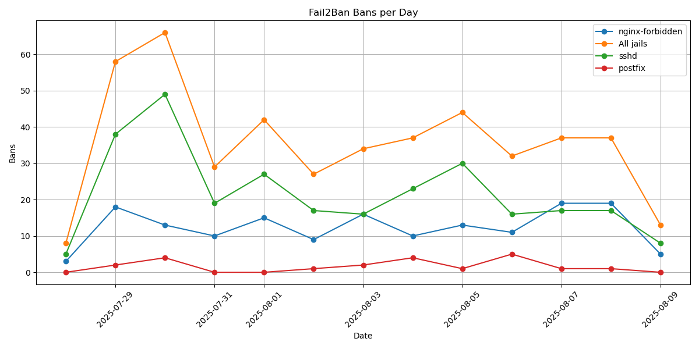

# Fail2Ban Data Tools

Small utilities to extract daily ban counts from Fail2Ban logs into a CSV and plot them.

## Dependencies

The plotting script requires
[Matplotlib](https://matplotlib.org/).

On Debian/Ubuntu you can install it with:

```bash
sudo apt update && sudo apt install -y python3-matplotlib
```

## Usage

### `generate_bans_summary.py`

Reads `/var/log/fail2ban.log*` (plain and compressed) and writes a CSV file with the number of bans per day and per jail.

Run:
```bash
python3 generate_bans_summary.py
```

This generates a CSV file (by default `bans_summary.csv`) with contents like:

```
date,All jails,sshd,nginx-forbidden,postfix
2025-07-28,8,5,3,0
2025-07-29,58,38,18,2
2025-07-30,66,49,13,4
...
```

### `plot_bans.py`

Reads the CSV generated by the previous script and produces a line chart.

Run:
```bash
python3 plot_bans.py
```

This generates an image (by default `bans_summary.png`) similar to:



### Other parameters

Both scripts support other parameters, for instance:

```bash
python3 generate_bans_summary.py -o file.csv
python3 plot_bans.py -i file.csv -o file.png --width 12 --heigh 6 --dpi 100
```

You can see all available options by running:

```bash
python3 generate_bans_summary.py --help
python3 plot_bans.py --help
```

## Extending default log history

Since the scripts rely on Fail2Ban logs, which by default keep ~4 weeks of
history via logrotate, you may want to increase the retention period (e.g. to
1 year) by adjusting `/etc/logrotate.d/fail2ban`, for example replacing:

```
    rotate 4
```

with:

```
    rotate 52
```

## License

MIT
